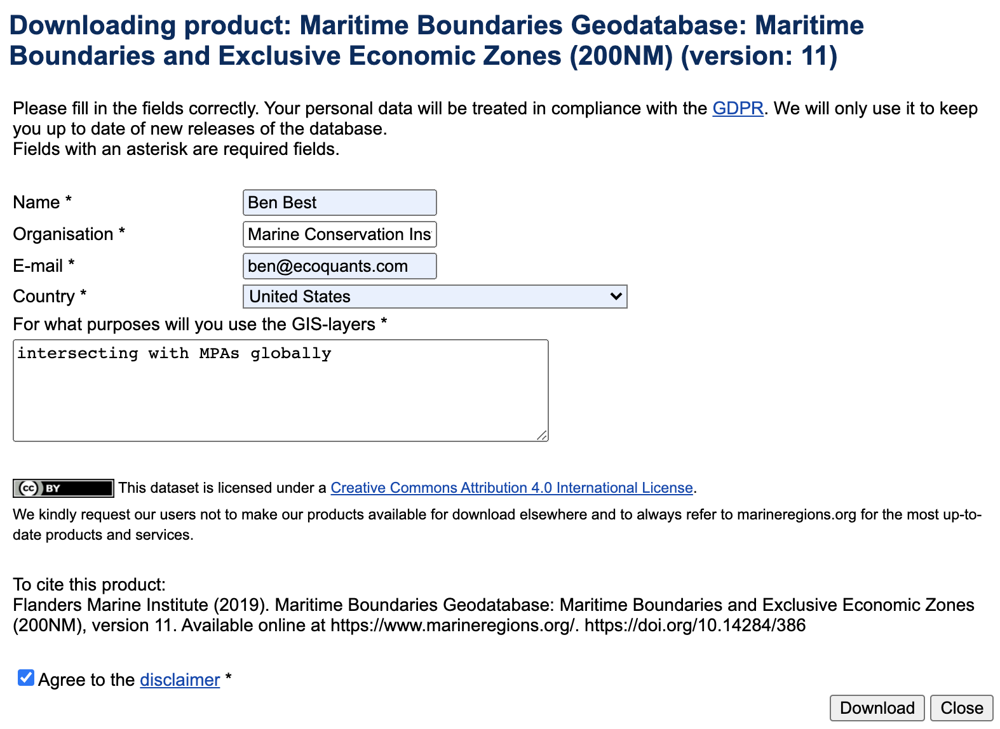

```{r setup, include=FALSE}
knitr::opts_chunk$set(echo = T, message = F, warning = F)
```

## Load data

### Connect to database

```{r}
# load libraries, functions, database connnection (con)
source("functions.R")

# tables
tbls <- dbListTables(con)
tbls
```

### EEZ

The `download.file()` doesn't work in following code chunk:

```{r eez_notdownload, eval = F}
ds <- list(
  name   = "EEZ",
  name_v = "EEZ_v11_20191118",
  org    = "marineregions.org",
  url_dl = "https://marineregions.org/download_file.php?name=World_EEZ_v11_20191118_gpkg.zip",
  f_dl   = "World_EEZ_v11_20191118_gpkg.zip")

dir_ds  <- glue("/share/data/{ds$org}/{ds$name_v}")
path_dl <- glue("{dir_ds}/{ds$f_dl}")
dir_create(dir_ds)

download.file(ds$url_dl, path_dl)

if (path_ext(path_dl) == "zip")
  unzip(path_dl, exdir = dir_ds)
```

since MarineRegions.org requires a form to be filled out:



So instead, it was downloaded locally on my personal machine into the Google Drive folder `mci - mpatlas/` here:

`/Volumes/GoogleDrive/My Drive/projects/mci - mpatlas/data/marineregions.org/World_EEZ_v11_20191118_gpkg.zip`


Then uploaded:

```bash
sftp -i ~/private/mpatlas.pem ubuntu@mpatlas4r.org

# at prompt sftp>
lcd '/Volumes/GoogleDrive/My Drive/projects/mci - mpatlas/data/marineregions.org'
mkdir data/marineregions.org
cd data/marineregions.org
put World_EEZ_v11_20191118_gpkg.zip
exit
```

TODO: Mount `/home/ubuntu/data` on host to docker and sync w/ CyberDuck and Gdrive.

From server to container:

```bash
# log into server
ssh -i ~/private/mpatlas.pem ubuntu@mpatlas4r.org

# copy into container
docker cp ~/data/marineregions.org/World_EEZ_v11_20191118_gpkg.zip postgis:/share/data/marineregions.org/EEZ_v11_20191118/.

# log into container
docker exec -it postgis bash

# unzip
apt-get install zip
cd /share/data/marineregions.org/EEZ_v11_20191118
unzip World_EEZ_v11_20191118_gpkg.zip
ls World_EEZ_v11_20191118_gpkg
# eez_boundaries_v11.gpkg  eez_v11.gpkg  LICENSE_EEZ_v11.txt

ogr2ogr --version
# GDAL 3.1.0, released 2020/05/03

pass=`cat /share/mpatlas4r.org_password.txt`
ogrinfo -ro PG:"host=localhost dbname=gis user=admin password=$passwd"

gpkg='/share/data/marineregions.org/EEZ_v11_20191118/World_EEZ_v11_20191118_gpkg/eez_v11.gpkg'
tbl='eez'
ogr2ogr -f "PostgreSQL" PG:"host=localhost dbname=gis user=admin password=$passwd" "$gpkg" -nln "$tbl" # -append
```

```{r}
# tables
tbls <- dbListTables(con)
tbls
```

### optimize

On Terminal of rstudio.mpatlas4r.org:

```bash
sudo apt-get update; sudo apt-get install postgresql

pass=`cat /share/mpatlas4r.org_password.txt`


hostname:port:database:username:password

echo "postgis:5432:gis:admin:$pass" > ~/.pgpass
chmod 0600 ~/.pgpass
psql -h postgis -U admin -d gis
# OR
psql -h postgis -d gis
```

```
\d spatialdata_eez
ERROR:  column c.relhasoids does not exist


c.relhasoids
```

```{r}
eez <- st_read(con, query = "SELECT * FROM spatialdata_eez LIMIT 100;")

eez %>% 
  st_drop_geometry() %>% 
  datatable()
```


```{sql, eval=F}
ALTER TABLE eez RENAME TO spatialdata_eez;
ALTER TABLE spatialdata_eez ADD COLUMN country TEXT;
UPDATE spatialdata_eez SET country = territory1;

-- FROM: Brendan Ward <bcward@astutespruce.com> 
-- DATE: 2020-03-02
--
-- create simplified versions of large polygons
-- arbitrary threshold of 200 km2 and simplifying by 100m; yields about 800 polys
-- can probably simplify up to 1000m with little noticeable impact at global scale down to z4?  z6?  However, too big a simplification level drops polys.
-- can't see much of 100-200 km2 areas at Z4 or below

-- Split countries from EEZ dataset (very big & slow dataset)
DROP TABLE IF EXISTS eez_poly CASCADE;

CREATE TABLE eez_poly AS (
  WITH tmp AS (
  SELECT
    country,
    (st_dump (geom)).geom::geometry AS geom
  FROM
    spatialdata_eez
  WHERE
    geom IS NOT NULL
)
  SELECT
    country, st_makevalid (geom) geom, round((st_area (geom::geography) / 1000000)::numeric, 2
) AS area_km2, round((st_area (st_envelope (geom)::geography) / 1000000)::numeric, 2
) AS bbox_area_km2
  FROM
    tmp
);
-- ERROR: 
--   FATAL:  failed to load summary "/usr/lib/postgresql/12/lib/bitcode/postgis-3.index.bc": Invalid summary version 8, 1, 2, 3 or 4 expected
--   SSL connection has been closed unexpectedly
--   The connection to the server was lost. Attempting reset: Succeeded.
--   psql (11.7 (Debian 11.7-0+deb10u1), server 12.3 (Debian 12.3-1.pgdg100+1))
--   WARNING: psql major version 11, server major version 12.
--            Some psql features might not work.
--   SSL connection (protocol: TLSv1.3, cipher: TLS_AES_256_GCM_SHA384, bits: 256, compression: off)


CREATE INDEX eez_poly_geom_idx ON eez_poly USING GIST (geom);

CREATE INDEX eez_poly_country_idx ON eez_poly (country);

-- subdivide tables for faster joins
-- 800s

CREATE TABLE eez_poly_subdivided AS
SELECT
  country,
  st_subdivide (geom) AS geom
FROM
  eez_poly
ORDER BY
  country;

CREATE INDEX eez_poly_subdivided_geom_idx ON eez_poly_subdivided USING GIST (geom);
```


```{r}
sql <- "
CREATE TABLE mpa_poly_subdivided AS
SELECT
  id,
  st_subdivide (geom) AS geom,
  area_km2,
  bbox_area_km2
FROM
  mpa_poly
ORDER BY
  id;

CREATE INDEX mpa_poly_subdivided_geom_idx ON mpa_poly_subdivided USING GIST (geom);

CREATE TABLE mpa_eez_poly_sjoin AS
SELECT
  id,
  country,
  mpa_poly_subdivided.area_km2 mpa_area_km2,
  round((st_area (st_intersection (mpa_poly_subdivided.geom, eez_poly_subdivided.geom)::geography) / 1000000)::numeric, 3) AS overlap_km2
FROM
  mpa_poly_subdivided,
  eez_poly_subdivided
WHERE
  st_intersects (mpa_poly_subdivided.geom, eez_poly_subdivided.geom);"
```


## Analyze

### EEZ

```{r}

```

